# Final Project - SOICT - HUST

## Introduction
__Project Title__: Building a Big Data Collection, Processing, Storage, and Visualization System - Experimentation with New York City Taxi Trip Data

__Description__: This system implements a complete big data processing pipeline with independent modules for data collection, storage, processing, visualization and management. Each component is designed for high scalability, easy maintenance, and strong fault tolerance through deployment on an on-premise Kubernetes platform.

## System Architecture
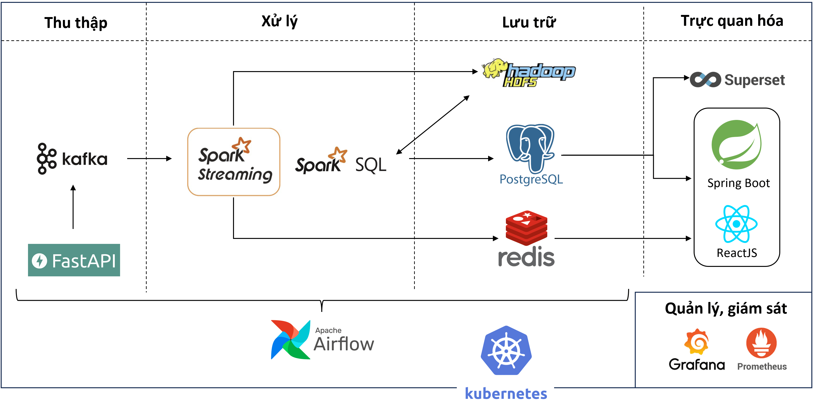
## Deployment Process

### 1. Install Kubernetes Cluster
See [K8s Cluster Installation Guide](./k8s/installation/install-k8s-cluster.md)

---

### 2. Install Required Tools and Servers
See [Essential Tools Installation Guide](./k8s/installation/install-tools.md)

---

### 3. Deploy Applications to Kubernetes Environment
__Add values.yaml files on k8s-master-1__

Directory structure:
```bash
├── airflow/values.yaml
├── spark/values.yaml
├── hadoop/values.yaml
├── redis/values.yaml
├── postgreSQL/values.yaml
├── superset/values.yaml
```
---

__Install Applications Using Helm (execute on k8s-master-1)__:

__3.1. Add Helm chart repositories:__
```bash
helm repo add apache-airflow https://airflow.apache.org

helm repo add pfisterer-hadoop https://pfisterer.github.io/apache-hadoop-helm/

helm repo add bitnami https://charts.bitnami.com/bitnami
```

__3.2. Install Airflow:__
```bash
# Add storage class for Airflow
helm install nfs-airflow-storage nfs-subdir-external-provisioner/nfs-subdir-external-provisioner \
  --namespace kube-system \
  --set nfs.server=192.168.164.206 \
  --set nfs.path=/A/airflow \
  --set storageClass.name=nfs-airflow-storage \
  --set storageClass.defaultClass=false \
  --set storageClass.accessModes={ReadWriteMany} \
  --set storageClass.reclaimPolicy=Retain

# Install Airflow
cd airflow/

helm install airflow apache-airflow/airflow -n bigdata -f values.yaml
```
Add source code and DAG files to /A/airflow/code and /A/airflow/dags on nfs-server


__3.3. Install Hadoop:__
```bash
# Add storage class
helm install nfs-hadoop-storage nfs-subdir-external-provisioner/nfs-subdir-external-provisioner \
  --namespace kube-system \
  --set nfs.server=192.168.164.206 \
  --set nfs.path=/B/hadoop \
  --set storageClass.name=nfs-hadoop-storage \
  --set storageClass.defaultClass=false \
  --set storageClass.accessModes={ReadWriteOnce} \
  --set storageClass.reclaimPolicy=Retain

# Install Hadoop
cd hadoop/

helm install hadoop pfisterer-hadoop/hadoop --namespace bigdata -f values.yaml

```
Add [ingress](./k8s/hadoop/namenode-ingress.yaml) to access HDFS web interface


__3.4. Install Redis:__

Add PV/PVC for Redis via Rancher UI: [redis-pv-pvc.yaml](./k8s/redis/redis-pv-pvc.yaml)

```bash
cd redis/

helm install redis bitnami/redis --values values.yaml --namespace bigdata
```

__3.5. Install Spark:__
```bash
cd spark/

helm install spark bitnami/spark --values values.yaml --namespace bigdata
```

__3.6. Install PostgreSQL:__

Add PV/PVC for PostgreSQL via Rancher UI: [postgresql-pv-pvc.yaml](./k8s/postgreSQL/postgresql-pv-pvc.yaml)

```bash
cd postgreSQL/

helm install postgresql-db bitnami/postgresql --values values.yaml --namespace bigdata
```

__3.7. Install Superset:__
```bash
# Add storage class
helm install nfs-superset-storage nfs-subdir-external-provisioner/nfs-subdir-external-provisioner \
  --namespace kube-system \
  --set nfs.server=192.168.164.206 \
  --set nfs.path=/A/superset \
  --set storageClass.name=nfs-superset-storage \
  --set storageClass.defaultClass=false \
  --set storageClass.accessModes={ReadWriteMany} \
  --set storageClass.reclaimPolicy=Delete

# Install Superset
cd superset/

helm install superset bitnami/superset --values values.yaml --namespace bigdata
```

__3.8. Install Kafka__
```bash
# Add storage class
helm install nfs-kafka-storage nfs-subdir-external-provisioner/nfs-subdir-external-provisioner \
  --namespace kube-system \
  --set nfs.server=192.168.164.206 \
  --set nfs.path=/A/kafka \
  --set storageClass.name=nfs-kafka-storage \
  --set storageClass.defaultClass=false \
  --set storageClass.accessModes={ReadWriteOnce} \
  --set storageClass.reclaimPolicy=Delete
```

Deploy components via Rancher UI: [Cụm Kafka](./k8s/kafka/kafka.yaml), [KafkaUI](./k8s/kafka/kafka-ui.yaml) và [Zookeeper](./k8s/kafka/zookeeper.yaml)

__3.9. Install Data Ingestion (via Rancher UI)__

- Add [volume](./k8s/data-ingestion/data-ingestion-volumes.yaml) for data ingestion
- Add source data files to /A/data-ingestion/data on nfs-server
- Deploy  [data-ingestion-api-server](./k8s/data-ingestion/data-ingestion-api-server.yaml)

__3.10. Install WebServer (via Rancher UI)__

- Add [Configmap](./k8s/webserver/backend-configmap.yaml) for Web Backend

- Deploy [backend](./k8s/webserver/backend.yaml) and [frontend](./k8s/webserver/frontend.yaml)

## Deployment Results and Experimentation

### Kubernetes Deployment
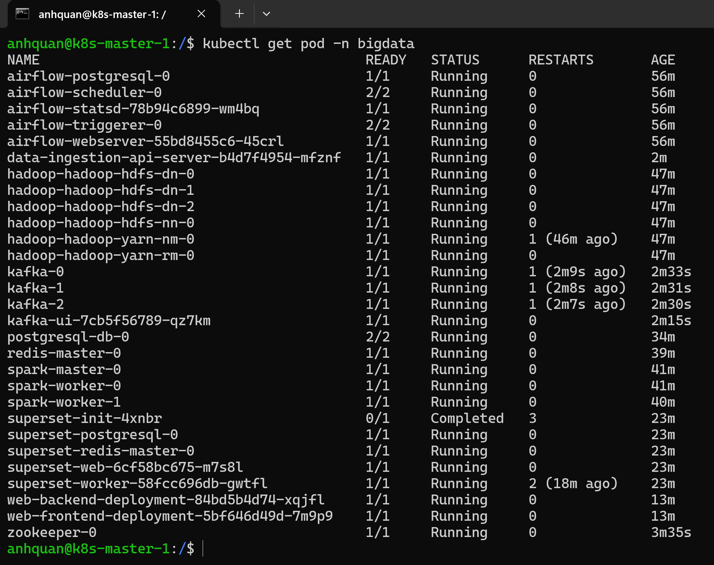

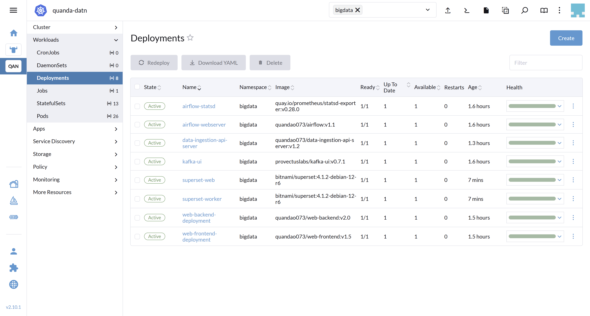


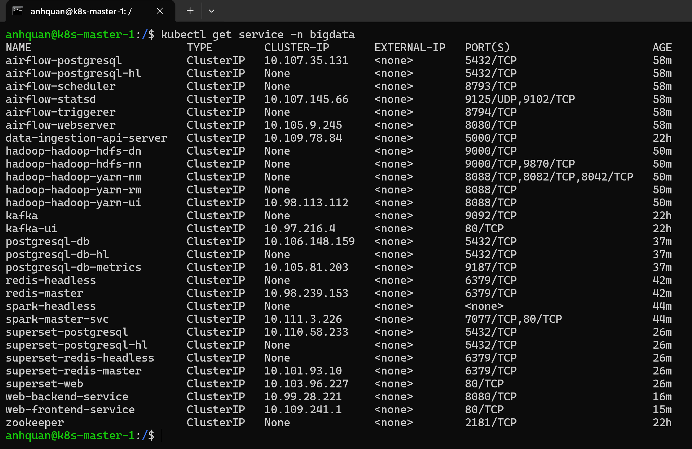

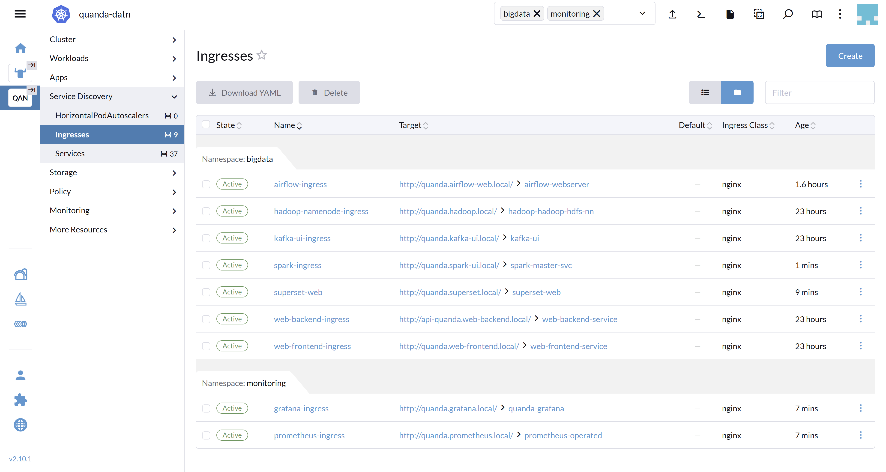

### Experimentation Results with NYC Taxi Data
---

__Data Collection__

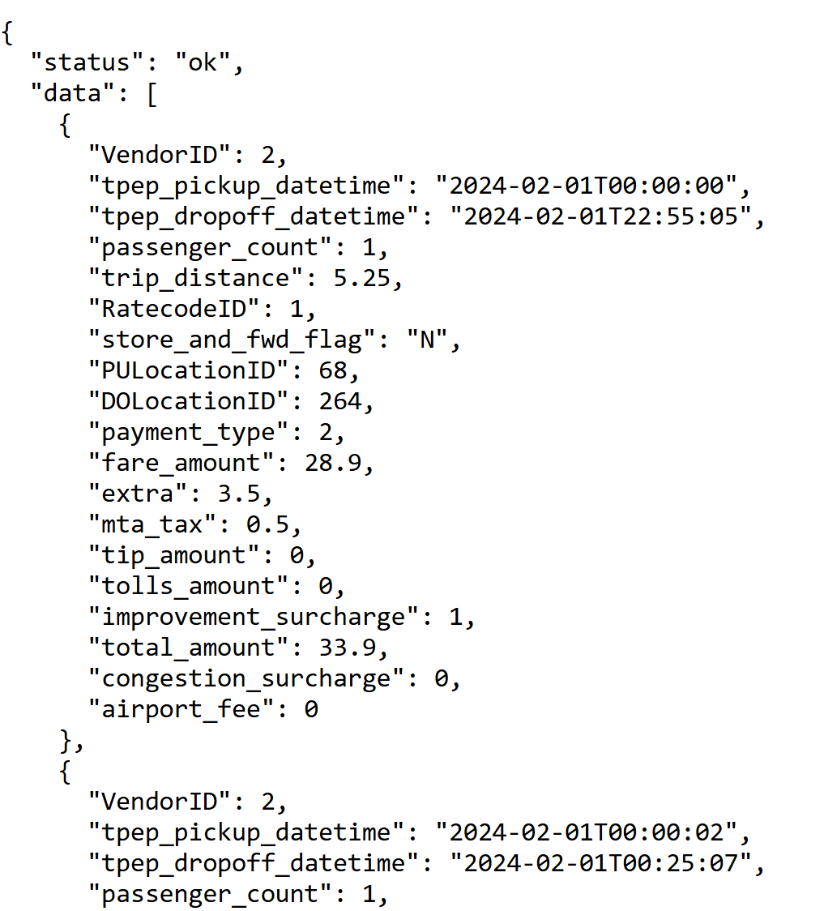

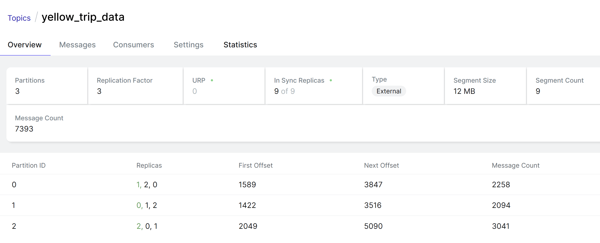

---

__Data Processing__

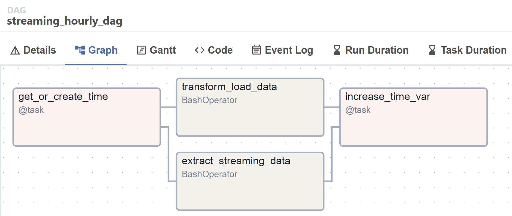

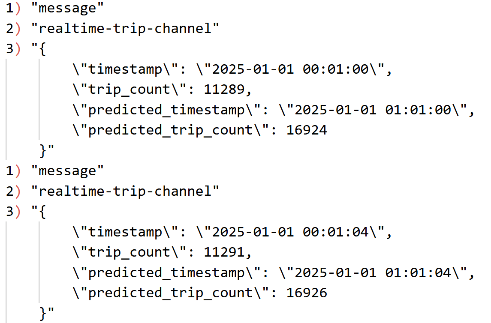

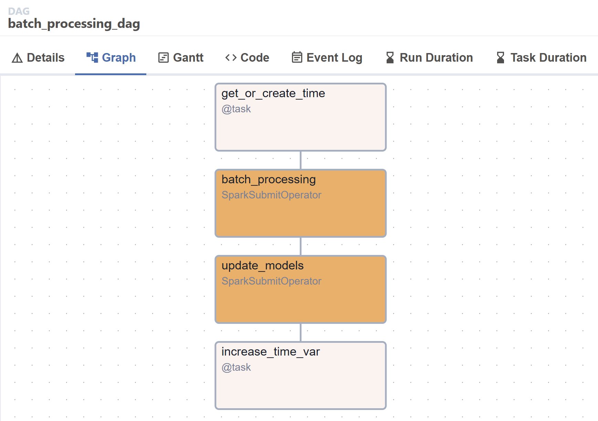

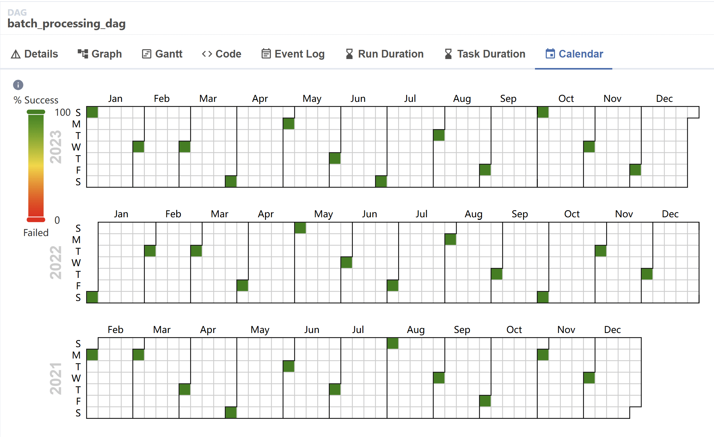

---

__Data Storage__

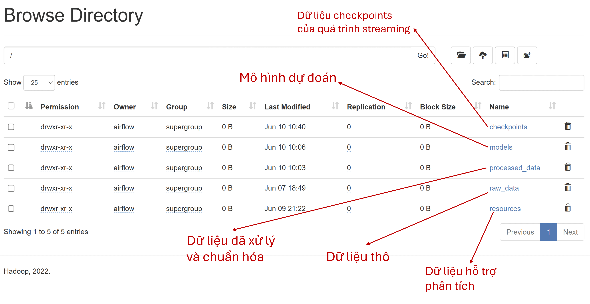

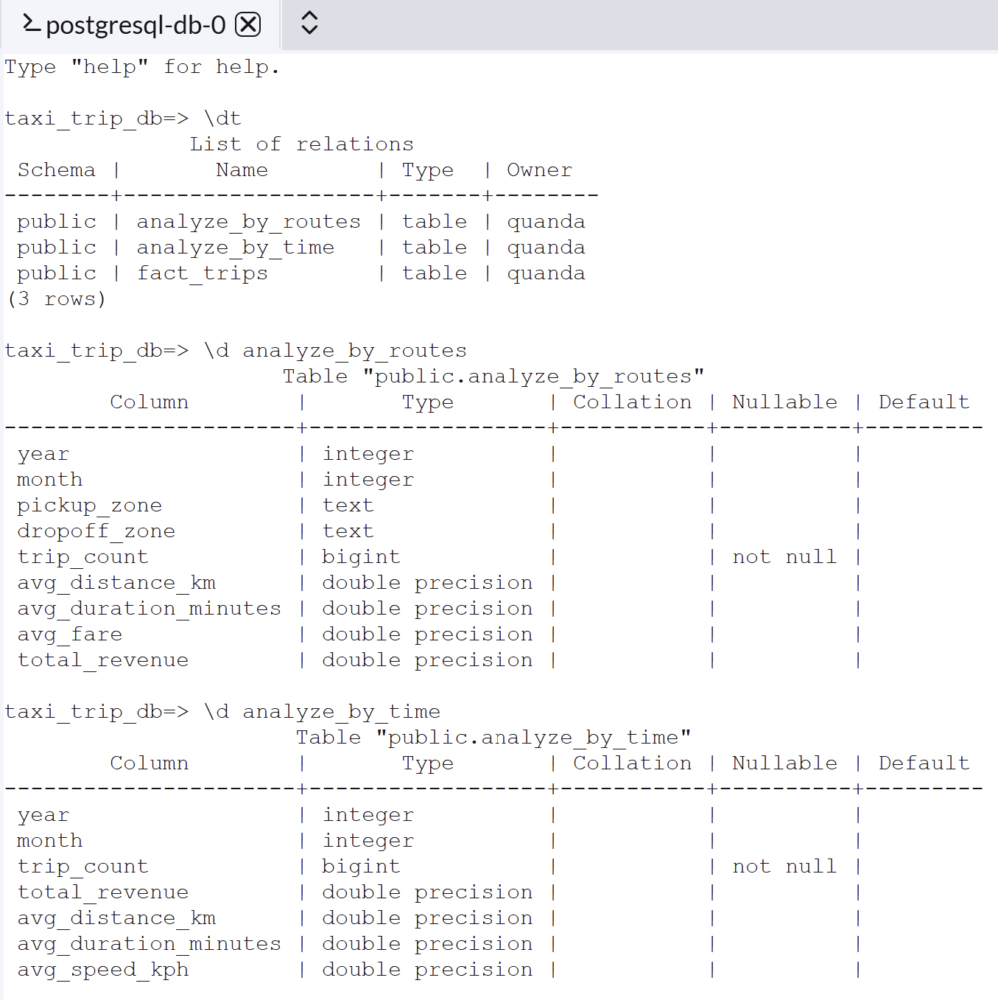
---

__Data Visualization__

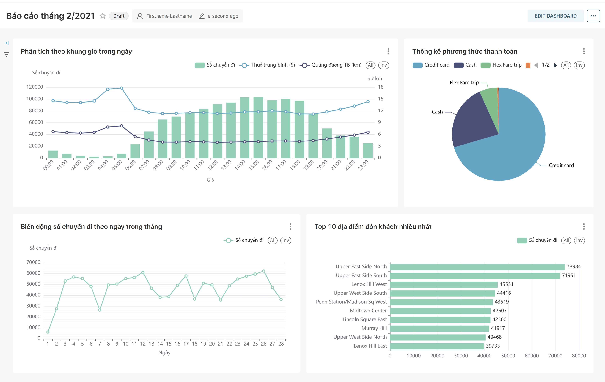

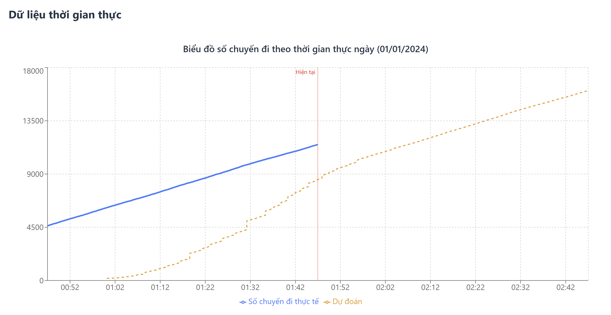

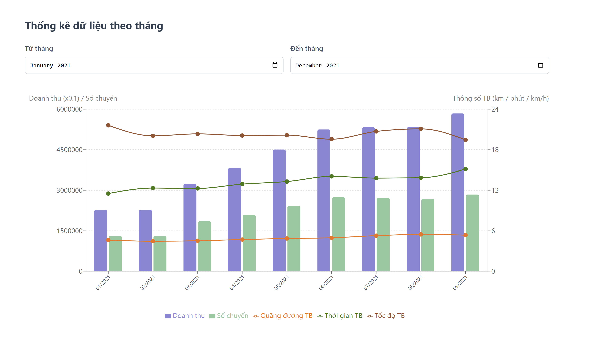

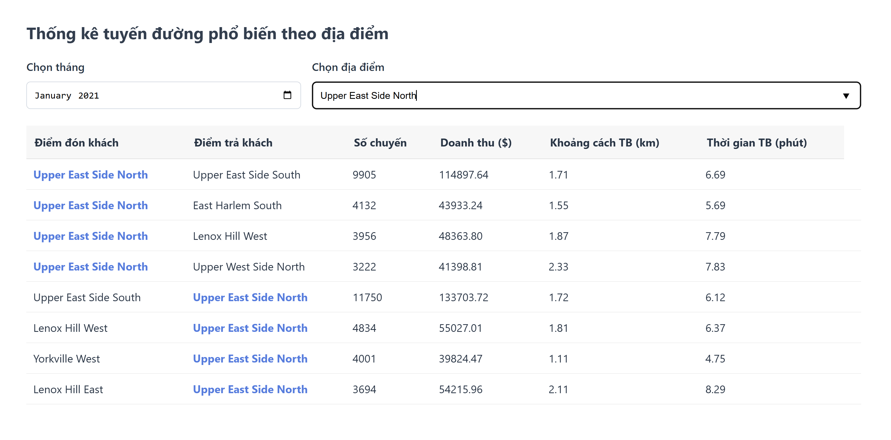
---

### Project details are presented in the [Final Report]()